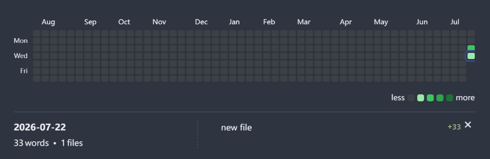

# Word Count Heatmap

[中文说明文档 (README_CN.md)](README_CN.md)

An Obsidian plugin that visualizes your daily writing productivity with a GitHub-style word or character count heatmap.



## Features

- **GitHub-Style Heatmap**: Visualizes your daily word or character counts over a custom date range (e.g., last 30 days, 365 days, or a fixed year).
- **Interactive Details Panel**: Click any day in the heatmap to inspect the breakdown of words written, including which files were edited and how many words were added to each.
- **Customizable Color Thresholds**: Define your own color shading intervals (steps 1 to 3) in the settings menu to match your writing goals.
- **Flexible Exclusions**: Exclude specific folders from being tracked in your word counts.
- **Multilingual Support**: Supports English and Chinese UI, seamlessly adapting to your Obsidian system locale.
- **Toggleable Metrics**: Choose between tracking word count (for English) or character count (recommended for Chinese).

## Usage

### Method 1: Command Palette (Ctrl/Cmd + P)
1. Open the Command Palette using `Ctrl + P` (Windows/Linux) or `Cmd + P` (macOS).
2. Type and select `Word Count Heatmap: Insert Word Heatmap` (or `插入字数热力图` in Chinese environment).
3. The plugin will automatically insert a code block at your current cursor position:
   ```word-heatmap
   ```

### Method 2: Manual Code Block Insertion
Simply insert the following code block in any note to render the heatmap:

```word-heatmap
```

You can configure the heatmap directly by clicking the **Set** (settings) button in the upper-right corner of the rendered block, or by defining config parameters inline using YAML:

## Settings

Access the plugin configuration modal via the gear icon on the heatmap block to customize:
1. **Basic Settings**: Title, Language, Date Range, Start of Week.
2. **Metrics & Filters**: Word/Character Count tracking, folder exclusions, and details retention policy.
3. **Style & Layout**: Themes and grid layout behavior.
4. **Color Shading Intervals**: Set the specific count thresholds for each color intensity level (Light → Medium-Light → Medium-Dark → Darkest).

## Installation

### From Community Plugins
1. Open Obsidian settings.
2. Go to **Community plugins** -> **Browse**.
3. Search for `Word Count Heatmap`.
4. Click **Install**, then **Enable**.

### Via BRAT (Beta Reviewer's Auto-update Tool)
1. Install the **BRAT** plugin from the community plugin store and enable it.
2. Open Obsidian settings and find **BRAT** in the sidebar.
3. Click **Add Beta plugin**.
4. Enter the GitHub repository URL: `https://github.com/AshenAshes/obsidian-word-heatmap`.
5. Click **Add Plugin**, then enable `Word Count Heatmap` under **Community plugins** settings.

### Manual Installation
1. Download `main.js`, `manifest.json`, and `styles.css` from the releases.
2. Create a folder named `obsidian-word-heatmap` under your vault's `.obsidian/plugins/` directory.
3. Copy the downloaded files into that folder.
4. Reload Obsidian and enable the plugin in the **Community plugins** settings.

## License

This project is licensed under the [MIT License](LICENSE).
