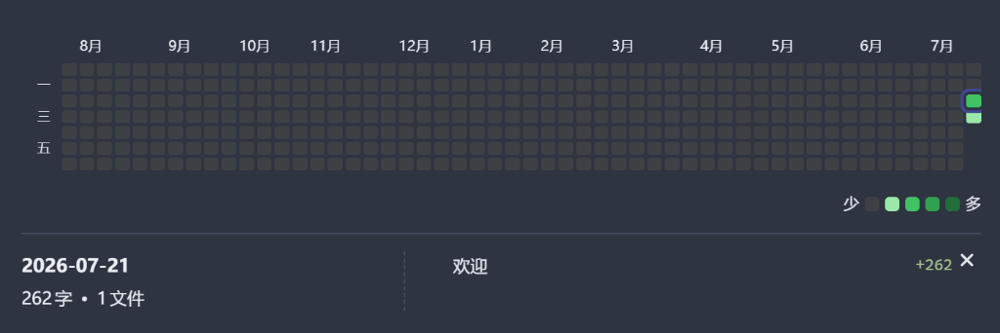

# Word Count Heatmap (字数热力图)

[English Documentation (README.md)](README.md)

一个用于 Obsidian 的每日写作进度可视化插件，能够生成类似 GitHub 贡献图样式的字数/字符数热力图。

## 主要功能

- **GitHub 风格热力图**：直观展示你在自定义时间段内（例如：最近 30 天、最近 365 天或固定年份）的每日写作字数或字符数。
- **互动详情面板**：点击热力图上的任意日期，可查看当天写作的详细数据（包括修改了哪些笔记文件以及每个笔记具体增加了多少字数）。
- **自定义色块区间**：可在设置中自由定义不同深浅色块所对应的字数阶梯（一级阶梯、二级阶梯、三级阶梯），匹配你的个人写作目标。
- **灵活的文件夹排除**：支持设置排除特定文件夹，不计入统计范围。
- **双语支持**：提供中文和英文界面，自动适应 Obsidian 的系统语言设置。
- **计量模式切换**：支持“词数（Word）”与“字符数（Char）”两种统计模式（中文推荐使用“字符数”）。

## 使用方法

### 方式一：命令面板 (Ctrl/Cmd + P)
1. 使用快捷键 `Ctrl + P` (Windows/Linux) 或 `Cmd + P` (macOS) 打开命令面板。
2. 输入并选择 `Word Count Heatmap: 插入字数热力图`（或英文环境下的 `Word Count Heatmap: Insert Word Heatmap`）。
3. 插件会自动在当前光标位置插入代码块：

 > \`\`\`word-heatmap
 >
 > \`\`\`

### 方式二：手动插入代码块
在任意笔记中插入以下代码块，即可自动渲染热力图：

 > \`\`\`word-heatmap
 >
 > \`\`\`

你可以通过点击渲染出来的热力图右上角的 **Set** 按钮在可视化配置界面中修改设置，也可以直接在代码块中通过 YAML 语法配置参数。

## 配置项说明

点击热力图右上角齿轮图标，即可弹出配置菜单：
1. **基础设置**：标题、显示语言、统计天数范围、每周起始日（周一或周日）。
2. **统计与过滤**：切换字数/字符数统计方式、排除特定文件夹、历史明细数据留存清理策略。
3. **样式与布局**：多种主题色、填充布局行为。
4. **色块字数区间**：设置热力图不同颜色深浅所代表的每日字数阶梯（浅色 → 中浅 → 中深 → 最深）。

## 安装方式

### 社区插件市场（推荐）
1. 打开 Obsidian 的设置。
2. 选择 **社区插件** -> **浏览**。
3. 搜索 `Word Count Heatmap`。
4. 点击 **安装**，随后点击 **启用**。

### 通过 BRAT 插件安装（测试/更新快）
1. 在社区插件市场中安装并启用 **BRAT** 插件。
2. 打开 Obsidian 设置，在左侧导航栏找到 **BRAT**。
3. 点击 **Add Beta plugin**（添加测试版插件）。
4. 在弹出的输入框中填入本仓库的 GitHub 地址：`https://github.com/AshenAshes/obsidian-word-heatmap`。
5. 点击 **Add Plugin** 确认，随后在 **社区插件** 设置页启用 `Word Count Heatmap` 即可。

### 手动安装
1. 从 Releases 中下载 `main.js`、`manifest.json` 和 `styles.css` 文件。
2. 在你的保管库（Vault）目录的 `.obsidian/plugins/` 路径下，新建一个名为 `obsidian-word-heatmap` 的文件夹。
3. 将下载的文件放入该文件夹中。
4. 重启 Obsidian 并前往 **社区插件** 设置页启用该插件。

## 许可证

本项目基于 [MIT 许可证](LICENSE) 开源。
